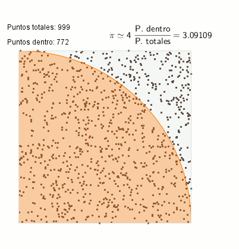
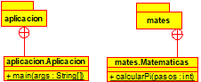

# README #
*16/02/2021 - 17/02/2021*  

>Copyright [2020] (Alejandro Ramirez Larena copyright)
Licensed under the Apache License, Version 2.0 (the "License");
you may not use this file except in compliance with the License.
You may obtain a copy of the License at
http://www.apache.org/licenses/LICENSE-2.0
Unless required by applicable law or agreed to in writing, software
distributed under the License is distributed on an "AS IS" BASIS,
WITHOUT WARRANTIES OR CONDITIONS OF ANY KIND, either express or implied.
See the License for the specific language governing permissions and
limitations under the License.  

**Trabajo Programacion II**

### Proyecto I ###

-El programa genera mediante el metodo de Montecrlo una aproximacion a PI.  

-El programa se ejecuta con los siguientes comandos.

### Comandos para compilar y generar javadoc ###

-Para iniciar el programa hacer make run

-Si quieres realizar una demo del programa use el comando make demo

>Para compilar hay que usar desde la carpeta raiz make compilar  

>Para crear el .jar desde la carpeta raiz make jar  

>Para crear el java doc make javadoc  

### Ejemplo del metodo de Montecarlo ###

### Como usar ###
-Para generar la aproximacion necesitamos introducir un numero de "dardos". 

### Comandos y ejemplos de uso ###
-De esta forma se "tiran los dardos"  java -jar aplicacion.jar 100 

-El numero que se introduce es el numero de dardos

### Realizado por:

Alejandro Ramirez Larena  
 

### Diagrama UML###

-Este es el digrama creado con Umbrello de el programa.  

 

